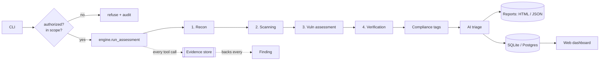

<div align="center">

# 🛡️ Sentari

### Evidence-grounded security assessment for security teams, with optional AI triage

<p>
  
  
  
  
  
  <a href=".github/workflows/ci.yml"></a>
</p>

</div>

Sentari runs real security tools and reports only what they actually found. Every finding points back to the exact command that produced it, its output, exit code, and timing. There are no hardcoded results, and nothing invented by a language model.

> **The rule that defines Sentari:** a finding exists only when a real command produced evidence for it. This is enforced in code, a `Finding` cannot be created without evidence, and it holds through the AI layer, which discards any reference to a finding that does not exist.

---

## 📑 Contents

- [Why Sentari](#-why-sentari)
- [Features](#-features)
- [Architecture](#️-architecture)
- [Quick start](#-quick-start)
- [Phases](#-phases)
- [Command-line options](#️-command-line-options)
- [Examples](#-examples)
- [Configuration](#️-configuration)
- [Web dashboard and distributed runs](#-web-dashboard-and-distributed-runs)
- [Project layout](#-project-layout)
- [Testing](#-testing)
- [Documentation](#-documentation)
- [Authorization and safety](#-authorization-and-safety)
- [License](#-license)

---

## 🎯 Why Sentari

- **Auditable results.** Each finding carries the command, output, exit code, and timestamp behind it. You can check any result against its evidence.
- **No fabrication.** The data model rejects a finding with no evidence, and the AI triage step drops any finding id it did not receive. The tool cannot invent a vulnerability.
- **Runs anywhere.** The core uses only the Python standard library, so it works wherever Python does. External scanners and services are optional.
- **Safe by default.** It refuses to run outside a declared scope, requires an authorization flag, keeps intrusive checks behind a gate, and logs every run.

## ✨ Features

### 🔍 Reconnaissance
- DNS resolution and IP mapping
- Port and service discovery: a built-in TCP connect scan, enriched by `nmap -sV` when present
- Web fingerprint of discovered HTTP services

### 📡 Scanning and enumeration
- HTTP security-header analysis (CSP, HSTS, X-Frame-Options, and more)
- TLS inspection, including real handshakes against TLS 1.0/1.1 to detect legacy protocols
- Technology and version disclosure
- Content discovery with `gobuster`/`ffuf`, or a built-in probe for common sensitive paths

### 🧪 Vulnerability assessment
- `nuclei` template scanning, mapped into findings with their evidence
- `sqlmap`, behind a gate so it only runs when you opt in

### ✅ Verification (safe exploitation)
- Read-only confirmation of findings, such as fetching an exposed `.git/config` to prove it is real
- Runs only with `--no-safe-mode`; retrieved secrets are redacted before they reach any report

### 🤖 Grounded AI triage
- 14 providers: OpenAI, Anthropic, Google, DeepSeek, Mistral, Groq, xAI, Together, Fireworks, Perplexity, GLM, NVIDIA, OpenRouter, and local models through Ollama. Any provider-specific model id works, and `--list-models` shows the known ones.
- Prioritizes findings, groups them into attack chains, and suggests fixes
- Works only from the real findings, and drops any reference the model invents

### 🧭 AI autopilot
- With `--autopilot`, the model chooses which phase to run next and when to stop, based on what has been found so far
- It controls only the flow. The target is fixed, findings still come from the tools with evidence, and scope and safe mode are enforced on every step
- If no model is available, or the model returns an invalid action, it falls back to the normal phase order

### 🕹️ AI agent
- With `--agent`, the model calls tools directly in a loop (dns, port scan, http, nuclei, gated sqlmap), plans each step from the real results, and can author findings
- A finding is accepted only when it cites an `evidence_id` a tool actually returned; a verifier pass then drops any model-authored finding the evidence does not support
- The host is fixed and arguments are validated, so an injected instruction in a target's response cannot redirect the host or run an arbitrary command
- Uses **native function-calling** on providers that support it (OpenAI and Anthropic tool APIs), and falls back to a provider-agnostic JSON protocol otherwise
- `--goal "focus on the API"` gives the agent a natural-language objective; with no model it runs a fixed recon sequence

### 📋 Compliance mapping
- Tags findings with OWASP Top 10 (2021), CWE, and NIST 800-53 references
- Shown in the console, the HTML report, and the JSON output

### 📊 Reporting and retest
- Self-contained HTML report with each finding linked to its evidence, plus JSON
- Retest diffs a fresh scan against a prior run and marks each item fixed, still present, or new

### 🗄️ Persistence and interfaces
- Run store in SQLite by default, or Postgres
- Read-only web dashboard and REST API, bound to localhost by default
- Optional Celery workers for distributed runs, with Docker, Compose, and Kubernetes manifests

### 🔌 Integrations and observability
- **SIEM export**: ship findings and a run summary to Splunk (HEC), Elasticsearch, syslog, or a generic webhook
- **Prometheus metrics**: a `/metrics` endpoint on the dashboard, plus a Grafana dashboard under `deploy/grafana/`
- **Model catalog**: `--list-models` shows the known models per provider; any provider-specific id also works
- **Cloud asset discovery**: `--cloud aws` (also azure/gcp) lists internet-facing assets in your own account so you can bring them into scope. Enumerate only, never scanned automatically
- **Scheduled retests**: a Celery beat schedule (`SENTARI_SCHEDULE_*`) reruns a target on a cron and reports the delta vs the previous run
- **CVSS scoring**: CVSS v3.1 base scores on nuclei findings that carry a vector

### 🔎 Prioritization aids (never vulnerability claims)
- **Anomaly flagging**: marks findings whose evidence is unusual for the target as "worth manual review"
- **Heuristic candidates**: flags error/stack-trace patterns in evidence as candidates for manual review. This is the honest form of "novel issue" flagging; it never asserts a vulnerability or a zero-day, and creates no findings

## 🏗️ Architecture

Phases 1 to 4 run tools through one shared engine; reporting and retest read the results.



Each package has one job:

| Package | Responsibility |
|---------|----------------|
| `models` | `Evidence`, `Finding`, `PhaseResult`; a finding cannot exist without evidence |
| `runner` | Runs external tools and built-in probes, captures each as evidence |
| `authorization` | Scope allowlist, attestation gate, audit log |
| `engine` | The one `run_assessment` path shared by the CLI and workers |
| `phases/` | `recon`, `scanning`, `vuln`, `verify` |
| `parsers/` | Tool-output parsers (for example, `nmap` XML) |
| `compliance` | OWASP / CWE / NIST tagging |
| `ai/` | Providers and the grounded analyst |
| `reporting/` | Console and HTML output |
| `retest` | Diff against a baseline |
| `db/` | SQLite / Postgres run store |
| `web/` | Read-only dashboard and REST API |
| `tasks/` | Celery app and task |

## 🚀 Quick start

**Prerequisites:** Python 3.9+. Optional scanners (`nmap`, `nuclei`, `nikto`, `gobuster`/`ffuf`, `sqlmap`) add coverage; Sentari uses each when present and reports it as missing otherwise.

```bash
# install from source
git clone https://github.com/ahmadoqsrawi/sentari.git
cd sentari
pip install .

# verify
sentari --version

# first scan (localhost you control)
sentari 127.0.0.1 --scope 127.0.0.1 --authorized --html report.html
```

Optional extras:

```bash
pip install ".[ai]"           # OpenAI / Anthropic providers
pip install ".[distributed]"  # Celery workers + Redis
pip install ".[postgres]"     # Postgres run store
```

## 🧭 Phases

| # | Phase | What it does |
|---|-------|--------------|
| 0 | OSINT | passive subdomain enumeration (subfinder/amass/theHarvester) + Shodan lookup |
| 1 | Reconnaissance | DNS, port and service discovery (built-in / `naabu` / `nmap`), web fingerprint (built-in / `httpx`) |
| 2 | Scanning | security headers, TLS checks, version disclosure, content discovery |
| 3 | Vulnerability assessment | `nuclei` templates (with CVSS scoring), gated `sqlmap` |
| 4 | Verification | read-only confirmation of findings, secrets redacted |
| 5 | Reporting | evidence-linked HTML, JSON, XML, PDF |
| 6 | Retest | diff a fresh scan against a prior run |

A gated **exploitation** phase (Metasploit modules + bounded exfil-simulation) exists but is off by default. It runs only with `--no-safe-mode --exploit` and an exact confirmation string, and it is for authorized, non-production targets only.

```bash
sentari --list-phases
```

## ⚙️ Command-line options

| Option | Description |
|--------|-------------|
| `--scope HOST` (or CIDR) | Authorized target(s). Repeatable. Required. |
| `--authorized` | Attest you have permission to test the target. Required. |
| `--phases NAMES` | Comma-separated phase names, or `all` (default). |
| `--no-safe-mode` | Allow the gated, read-only verification checks. |
| `--html` / `--json` / `--xml` / `--pdf` FILE | Write the report in that format (PDF needs reportlab). |
| `--cloud {aws,azure,gcp}` | List internet-facing assets in your cloud account and exit. |
| `--exploit` (+ `--exploit-module`, `--exploit-confirm`) | Gated exploitation, authorized non-production only. |
| `--save-run DIR` | Save the run for the dashboard. |
| `--db DSN` | Persist runs to SQLite (a path) or Postgres (a `postgres://` URL). |
| `--retest FILE` / `--retest-latest` | Diff against a prior run (a file, or the last run in `--db`). |
| `--ai` | Grounded AI triage of the findings. |
| `--autopilot` | Let the AI choose which phases to run (findings stay tool-backed). |
| `--agent` / `--goal` | Full AI agent: the model calls tools directly, findings stay evidence-anchored. |
| `--ai-provider` / `--ai-model` / `--ai-base-url` | Choose the provider and model. |
| `--serve` | Start the read-only web dashboard instead of scanning. |
| `--siem-url` / `--siem-type` | Ship findings to a SIEM (webhook, splunk, elasticsearch, syslog). |
| `--list-models` | List known AI models per provider and exit. |
| `--no-anomaly` | Do not flag unusual findings for manual review. |
| `--enqueue` | Send the scan to a Celery worker. |
| `--dry-run` | Show what would run without executing anything. |

## 📝 Examples

Full assessment with both report formats:

```bash
sentari example.com --scope example.com --authorized \
    --html report.html --json report.json
```

Add grounded AI triage (needs a provider key, e.g. `OPENAI_API_KEY`):

```bash
sentari example.com --scope example.com --authorized --ai
```

Scope by CIDR, save to a database, then retest against the last stored run:

```bash
sentari 10.0.0.5 --scope 10.0.0.0/24 --authorized --db runs.db
sentari 10.0.0.5 --scope 10.0.0.0/24 --authorized --db runs.db --retest-latest
```

Browse saved runs in the read-only dashboard:

```bash
sentari --serve --db runs.db     # http://127.0.0.1:8600
```

Let the AI agent drive the assessment, with a goal and a chosen provider:

```bash
export OPENAI_API_KEY=...
sentari example.com --scope example.com --authorized \
    --agent --goal "focus on the login and the API"
```

Use a different provider (each reads its own key env var):

```bash
export GROQ_API_KEY=...
sentari example.com --scope example.com --authorized --ai --ai-provider groq

export ANTHROPIC_API_KEY=...
sentari example.com --scope example.com --authorized --agent --ai-provider anthropic \
    --ai-model claude-3-5-sonnet-latest

# a local model through Ollama, no key and nothing leaves the host
sentari example.com --scope example.com --authorized --ai --ai-provider ollama --ai-model llama3.1

# any OpenAI-compatible endpoint that is not built in
sentari example.com --scope example.com --authorized --ai \
    --ai-provider acme --ai-base-url https://api.acme.example/v1

sentari --list-models      # see the known models per provider
```

Ship findings to a SIEM, and scrape metrics with Prometheus:

```bash
sentari example.com --scope example.com --authorized \
    --siem-url https://splunk.example:8088/services/collector \
    --siem-type splunk --siem-token "$SPLUNK_HEC_TOKEN"

sentari --serve --db runs.db   # then scrape http://127.0.0.1:8600/metrics
```

## 🔧 Configuration

AI triage reads its key from the environment, or from the matching `--ai-*` flags:

```bash
export OPENAI_API_KEY=...        # or ANTHROPIC_API_KEY, etc.
export SENTARI_PROVIDER=openai   # optional; default provider
export SENTARI_MODEL=gpt-4o      # optional; default model
```

## 🌐 Web dashboard and distributed runs

The dashboard is read-only and binds to `127.0.0.1` by default. It shows completed runs and never starts a scan. For a Celery worker pool and the dashboard behind Redis and Postgres, see [`deploy/README.md`](deploy/README.md), which covers Docker Compose and Kubernetes.

## 📂 Project layout

```
sentari/
├── cli.py            # argument parsing and output
├── engine.py         # shared run_assessment path
├── models.py         # Evidence / Finding / PhaseResult
├── runner.py         # tool + built-in probe execution -> evidence
├── authorization.py  # scope, attestation, audit log
├── compliance.py     # OWASP / CWE / NIST tagging
├── concurrency.py    # thread pool for I/O-bound probes
├── retest.py         # baseline diff
├── phases/           # recon, scanning, vuln, verify
├── parsers/          # nmap XML, ...
├── reporting/        # console + HTML
├── ai/               # providers + grounded analyst
├── db/               # SQLite / Postgres store
├── web/              # read-only dashboard + REST API
└── tasks/            # Celery app + task
deploy/               # Dockerfile, docker-compose, k8s manifests
docs/                 # C4 architecture documentation
tests/                # unittest suite
```

## 🧪 Testing

```bash
python -m unittest discover -s tests -v      # no dependencies
# or, with pytest:
pip install ".[dev]" && pytest -q
```

## 📚 Documentation

Architecture documentation (C4 model, with diagrams) lives in [`docs/`](docs/): an overview, the architecture and workflow, per-domain deep dives, boundary interfaces, and a database overview.

## 🔐 Authorization and safety

Sentari runs real offensive tooling. It refuses to run unless the target is within a declared `--scope` and you attest with `--authorized`, and it records every run in an append-only audit log. Safe mode is on by default, so intrusive verification requires `--no-safe-mode`. Use it only against systems you own or have written permission to test. See [SECURITY.md](SECURITY.md).

## 📄 License

Proprietary, no-derivatives. See [LICENSE](LICENSE) and [NOTICE](NOTICE). You may use and share verbatim copies. You may not modify it, create derivatives, or redistribute modified versions.
