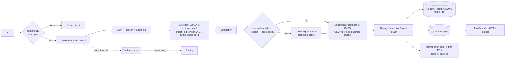

<div align="center">

# 🛡️ Sentari

### AI-driven penetration testing that validates findings with real proofs-of-concept

<p>
  
  
  
  
  
  <a href=".github/workflows/ci.yml"></a>
</p>

</div>

Sentari is an AI-driven penetration testing platform for developers and security teams. Its agents test a target dynamically, find vulnerabilities, and validate the high-impact ones with a real proof-of-concept (payload execution, or an out-of-band callback) rather than a signature match. It runs the whole methodology from reconnaissance to exploitation, and reports only what it can actually prove: every finding points back to the exact command that produced it, its output, exit code, and timing. There are no hardcoded results, and nothing invented by a language model.

> **The rule that defines Sentari:** a finding exists only when a real command produced evidence for it. This is enforced in code, a `Finding` cannot be created without evidence, and it holds through the AI layer, which discards any reference to a finding that does not exist.

---

## 📑 Contents

- [Why Sentari](#-why-sentari)
- [Features](#-features)
- [Architecture](#️-architecture)
- [Quick start](#-quick-start)
- [Phases](#-phases)
- [Command-line options](#️-command-line-options)
- [Examples](#-examples)
- [Configuration](#️-configuration)
- [Web dashboard and distributed runs](#-web-dashboard-and-distributed-runs)
- [Project layout](#-project-layout)
- [Testing](#-testing)
- [Documentation](#-documentation)
- [Authorization and safety](#-authorization-and-safety)
- [License](#-license)

---

## 🎯 Why Sentari

- **Auditable results.** Each finding carries the command, output, exit code, and timestamp behind it. You can check any result against its evidence.
- **No fabrication.** The data model rejects a finding with no evidence, and the AI triage step drops any finding id it did not receive. The tool cannot invent a vulnerability.
- **Runs anywhere.** The core uses only the Python standard library, so it works wherever Python does. External scanners and services are optional.
- **Safe by default.** It refuses to run outside a declared scope, requires an authorization flag, keeps intrusive checks behind a gate, and logs every run.

## ✨ Features

Recon and OSINT, dynamic (DAST) and static (SAST) testing, injection with out-of-band-confirmed exploits, client-side attacks, access control, API and JWT, cloud, AI triage and autonomous modes, gated exploitation, reporting, and integrations.

### 🔍 Reconnaissance
- DNS resolution and IP mapping
- Port and service discovery: a built-in TCP connect scan, enriched by `nmap -sV` when present
- Web fingerprint of discovered HTTP services

### 📡 Scanning and enumeration
- HTTP security-header analysis (CSP, HSTS, X-Frame-Options, and more)
- TLS inspection, including real handshakes against TLS 1.0/1.1 to detect legacy protocols
- Technology and version disclosure
- Content discovery with `gobuster`/`ffuf`, or a built-in probe for common sensitive paths
- **API spec ingestion** (`--openapi`): reads an OpenAPI v3, Swagger v2, or Postman collection and turns its endpoints into scan targets

### 🧪 Vulnerability assessment
- `nuclei` template scanning, mapped into findings with their evidence
- `sqlmap`, behind a gate so it only runs when you opt in

### 🖥️ Client-side DAST (`--browser`)
- Drives a headless browser (Playwright) against the discovered URLs
- Reflected, DOM-based, and (outside safe mode) stored XSS confirmed by actual execution, plus prototype pollution, clickjacking, token-less CSRF forms, password-over-HTTP, and mixed content
- Off by default; each finding carries the browser observation as evidence

### 💥 Injection and logic (`--injection`)
- **SSRF, XXE, and OS command injection confirmed out-of-band**: Sentari runs a listener and injects a URL that points back to it; a finding is raised only on a real callback (a working proof)
- **SSTI** confirmed when a template expression (7*7) is evaluated in the response
- **NoSQL injection** (differential), **mass assignment** (gated), and **insecure-deserialization** detection (serialized blobs in params/cookies)
- **Race conditions** (`--race-url`) and **session fixation** (`--session-fixation`)
- XXE and mass assignment POST data, so they run only outside safe mode

### 🧾 Business logic (`--workflow FILE`)
- Replays an operator-defined request sequence (with variable capture) and flags steps that succeed when they should fail (workflow/authorization bypass, price/quantity tampering) or return an unexpected status

### 🖳 Interactive shell (`--shell`)
- Opens a shell inside a disposable Docker container for authorized exploit development

### 🔓 Broken access control / IDOR (`--access-control`)
- Requests protected URLs as several supplied identities (`--identity NAME:HEADER:VALUE`) and anonymously
- Reports resources served without authentication, or served identically to different users while anonymous access is refused (an IDOR candidate). Sends only GETs; low false positives by design

### 🔑 API security and JWT (`--api-tests`, `--jwt`)
- Offline JWT audit: `alg=none`, weak HMAC secret (cracked from a wordlist), missing/expired expiry, sensitive payload claims
- Read-only endpoint checks over the ingested API surface: JWTs seen in responses, unauthenticated access, missing rate limiting, state-changing methods. Sends only GET/OPTIONS

### 🧬 SAST (`--sast PATH`)
- Runs semgrep over a source tree and maps results (with CWE/OWASP) into findings, alongside the dynamic phases

### ☁️ Cloud misconfiguration audit (`--cloud-audit`)
- Runs Prowler against your own AWS/Azure/GCP/Kubernetes account and maps failed checks (severity, resource, region) into findings

### 🕸️ Graph of agents (`--graph`)
- Specialized nodes (recon, assess, verify) share one blackboard so later nodes see earlier discoveries
- Multiple targets (`--graph-target`) run in parallel with a cross-asset correlation pass; every node runs the real phases

### 🧪 Custom PoC runtime (`--poc`, gated)
- Runs an operator-supplied Python proof-of-concept against the target inside a disposable Docker container
- A finding is recorded only when the PoC prints its own success marker; Sentari never decides that an exploit worked

### 🕸️ HTTP proxy capture (`--proxy`, `--proxy-ingest`)
- `--proxy PORT` runs an mitmproxy capture; route a browser or app through it to record real traffic
- `--proxy-ingest FILE` analyzes the capture (JSONL or HAR) for JWT weaknesses, credentials/secrets sent in cleartext, and insecure cookies
- `--proxy-web PORT` launches mitmweb for **live, interactive** request/response editing; `--tamper FILE` (with `--set-header`/`--set-param`/`--set-body`) replays a captured request with overrides and diffs the response; `--fuzz-param` sends it through a value list

### ✅ Verification (safe exploitation)
- Read-only confirmation of findings, such as fetching an exposed `.git/config` to prove it is real
- Runs only with `--no-safe-mode`; retrieved secrets are redacted before they reach any report

### 🤖 Grounded AI triage
- 14 providers: OpenAI, Anthropic, Google, DeepSeek, Mistral, Groq, xAI, Together, Fireworks, Perplexity, GLM, NVIDIA, OpenRouter, and local models through Ollama. Any provider-specific model id works, and `--list-models` shows the known ones.
- Prioritizes findings, groups them into attack chains, and suggests fixes
- Works only from the real findings, and drops any reference the model invents

### 🧭 AI autopilot
- With `--autopilot`, the model chooses which phase to run next and when to stop, based on what has been found so far
- It controls only the flow. The target is fixed, findings still come from the tools with evidence, and scope and safe mode are enforced on every step
- If no model is available, or the model returns an invalid action, it falls back to the normal phase order

### 🕹️ AI agent
- With `--agent`, the model calls tools directly in a loop (dns, port scan, http, nuclei, gated sqlmap), plans each step from the real results, and can author findings
- A finding is accepted only when it cites an `evidence_id` a tool actually returned; a verifier pass then drops any model-authored finding the evidence does not support
- The host is fixed and arguments are validated, so an injected instruction in a target's response cannot redirect the host or run an arbitrary command
- Uses **native function-calling** on providers that support it (OpenAI and Anthropic tool APIs), and falls back to a provider-agnostic JSON protocol otherwise
- `--goal "focus on the API"` gives the agent a natural-language objective; with no model it runs a fixed recon sequence

### 📋 Compliance mapping
- Tags findings with OWASP Top 10 (2021), CWE, and NIST 800-53 references
- Shown in the console, the HTML report, and the JSON output

### 📊 Reporting and retest
- Self-contained HTML report with each finding linked to its evidence, plus JSON
- Retest diffs a fresh scan against a prior run and marks each item fixed, still present, or new

### 🗄️ Persistence and interfaces
- Run store in SQLite by default, or Postgres
- Read-only executive web dashboard (KPI cards, severity and trend charts, risk matrix, compliance coverage) and REST API, bound to localhost by default
- Optional Celery workers for distributed runs, with Docker, Compose, and Kubernetes manifests

### 🔌 Integrations and observability
- **SIEM export**: ship findings and a run summary to Splunk (HEC), Elasticsearch, syslog, or a generic webhook
- **Prometheus metrics**: a `/metrics` endpoint on the dashboard, plus a Grafana dashboard under `deploy/grafana/`
- **Model catalog**: `--list-models` shows the known models per provider; any provider-specific id also works
- **GitHub Action**: a composite `action.yml` runs a Sentari assessment in CI with an authorization gate; see `examples/github-action-usage.yml`
- **Remediation as a draft PR**: `--autofix` writes a Markdown fix guide from the findings; `--autofix-pr` opens it as a draft PR (suggest-only, never edits code)
- **AI code-fix patches (human-applied)**: `--suggest-patches` produces validated unified diffs for source-mapped findings and writes them to a patch file; `--apply-fixes` (with `--apply-confirm`) applies them into the working tree uncommitted for review. Sentari never commits or merges
- **Cloud asset discovery**: `--cloud aws` (also azure/gcp) lists internet-facing assets in your own account so you can bring them into scope. Enumerate only, never scanned automatically
- **Scheduled retests**: a Celery beat schedule (`SENTARI_SCHEDULE_*`) reruns a target on a cron and reports the delta vs the previous run
- **CVSS scoring**: CVSS v3.1 base scores on nuclei findings that carry a vector
- **Threat-intel correlation**: matches finding CVEs against the CISA Known Exploited Vulnerabilities catalog and tags the ones known to be exploited in the wild. Reports what CISA lists; when the catalog is unreachable it says so rather than guessing
- **OpenVAS / Greenbone and Nexpose / InsightVM**: `--openvas` and `--nexpose` pull results from a configured scanner into the vuln phase as evidence-backed findings
- **AI-assisted OSINT**: `--ai-osint` lets the model propose likely subdomain labels; DNS confirms each one, so only names that actually resolve are recorded, and the model writes a short summary over the real assets

### 🔎 Prioritization aids (never vulnerability claims)
- **Anomaly flagging**: marks findings whose evidence is unusual for the target as "worth manual review"
- **Heuristic candidates**: flags error/stack-trace patterns in evidence as candidates for manual review. This is the honest form of "novel issue" flagging; it never asserts a vulnerability or a zero-day, and creates no findings
- **Business impact and risk matrix**: `--asset-value` weights each finding's CVSS or severity by how critical the asset is, and the report places findings on a likelihood by impact grid
- **Cross-asset correlation and trends**: `--correlate` surfaces a finding seen across more than one target; `--trends` shows severity counts per stored run over time

## 🏗️ Architecture

All phases run tools through one shared engine; gated exploitation, enrichment, AI triage, reporting, and retest read the results.



Each package has one job:

| Package | Responsibility |
|---------|----------------|
| `models` | `Evidence`, `Finding`, `PhaseResult`; a finding cannot exist without evidence |
| `runner` | Runs external tools and built-in probes, captures each as evidence |
| `authorization` | Scope allowlist, attestation gate, audit log |
| `engine` | The one `run_assessment` path shared by the CLI and workers |
| `phases/` | `osint`, `recon`, `scanning`, `vuln`, `verify`, and gated `exploit` / `postexploit` |
| `threatintel` / `classify` | CISA KEV correlation; rule-based service classification |
| `openvas` / `nexpose` / `privesc` | External scanner connectors; SSH privilege-escalation enumeration |
| `openapi` / `browser` / `sandbox` | API-spec ingestion; headless-browser DAST; Docker sandbox for gated tools |
| `jwt_audit` / `sast` / `proxy` | Offline JWT auditing; semgrep SAST parsing; mitmproxy capture analysis |
| `cloudaudit` / `pocrunner` / `graph` | Prowler misconfig parsing; sandboxed PoC runtime; multi-agent graph orchestration |
| `accesscontrol` | Broken-access-control / IDOR by comparing identities |
| `oob` / `injection` | Out-of-band listener; SSRF/XXE/cmdi/SSTI/NoSQLi/mass-assignment logic |
| `deserial` / `sessionfix` / `workflow` | Deserialization detection; session-fixation check; business-logic workflow replay |
| `tamper` | Request tamper/replay + response diff; parameter fuzzing |
| `autofix` / `patch` | Remediation guide and draft PR; AI code-fix diffs applied only by explicit user action |
| `ai/osint` | AI-proposed subdomains (DNS-confirmed) and a grounded OSINT summary |
| `prioritize` / `correlation` / `trends` | Business impact and risk matrix; cross-asset and over-time views |
| `parsers/` | Tool-output parsers (for example, `nmap` XML) |
| `compliance` | OWASP / CWE / NIST tagging |
| `ai/` | Providers and the grounded analyst |
| `reporting/` | Console and HTML output |
| `retest` | Diff against a baseline |
| `db/` | SQLite / Postgres run store |
| `web/` | Read-only dashboard and REST API |
| `tasks/` | Celery app and task |

## 🚀 Quick start

New here? The step-by-step, beginner-friendly guide with a required-vs-optional breakdown is in **[INSTALL.md](INSTALL.md)**.

**Prerequisites:** Python 3.9+. Optional scanners (`nmap`, `nuclei`, `nikto`, `gobuster`/`ffuf`, `sqlmap`) add coverage; Sentari uses each when present and reports it as missing otherwise.

```bash
# install from source
git clone https://github.com/ahmadoqsrawi/sentari.git
cd sentari
pip install .

# verify
sentari --version

# first scan (localhost you control)
sentari 127.0.0.1 --scope 127.0.0.1 --authorized --html report.html
```

Optional extras:

```bash
pip install ".[ai]"           # OpenAI / Anthropic providers
pip install ".[distributed]"  # Celery workers + Redis
pip install ".[postgres]"     # Postgres run store
```

## 🧭 Phases

| # | Phase | What it does |
|---|-------|--------------|
| 0 | OSINT | passive subdomain enumeration (subfinder/amass/theHarvester) + Shodan lookup |
| 1 | Reconnaissance | DNS, port and service discovery (built-in / `naabu` / `nmap`), web fingerprint (built-in / `httpx`) |
| 2 | Scanning | security headers, TLS checks, version disclosure, content discovery |
| 2 | SAST (`--sast`) | semgrep over a source tree, mapped to findings with CWE/OWASP |
| 3 | Vulnerability assessment | `nuclei` templates (with CVSS scoring), gated `sqlmap`, optional OpenVAS/Nexpose |
| 3 | API security (`--api-tests`) | JWT audit, rate-limit, auth-exposure, methods (GET/OPTIONS only) |
| 3 | Access control (`--access-control`) | broken-access-control / IDOR by comparing identities |
| 3 | Injection & logic (`--injection`) | SSRF/XXE/cmdi (OOB-confirmed), SSTI, NoSQLi, mass assignment, deserialization |
| 3 | Business logic (`--workflow`) | replay an operator-defined workflow spec |
| 3 | Proxy ingest (`--proxy-ingest`) | analyze captured HTTP traffic (mitmproxy JSONL or HAR) |
| 3 | Client-side DAST (`--browser`) | reflected/DOM XSS + prototype pollution (confirmed by execution), clickjacking, CSRF |
| 4 | Verification | read-only confirmation of findings, secrets redacted |
| 5 | Reporting | evidence-linked HTML, JSON, XML, PDF |
| 6 | Retest | diff a fresh scan against a prior run |

Two gated offensive phases exist but are off by default and never in the phase list:

- **Exploitation** (`--exploit`): operator-named Metasploit modules plus a bounded, redacted exfil-simulation.
- **Post-exploitation** (`--postexploit`): CrackMapExec SMB enumeration, bloodhound-python AD collection, and read-only SSH privilege-escalation enumeration (`--privesc`), with credentials you supply.

Each runs only with `--no-safe-mode`, its own flag, and an exact confirmation string (`I AM AUTHORIZED TO TEST THIS TARGET`), and is for authorized targets only, which may include production when you have explicit, written permission for that system. You are responsible for authorization and scope. The privilege-escalation checks are read-only and change nothing on the host. With `--sandbox`, the gated offensive tools run inside a disposable `docker run --rm` container instead of on the host; this isolates where commands run and does not loosen any gate.

`--autonomous` runs the full pipeline including gated exploitation, AI-driven, authorized once at launch (needs `--authorized`, `--no-safe-mode`, and the confirmation string), with no per-step prompts.

```bash
sentari --list-phases
```

## ⚙️ Command-line options

| Option | Description |
|--------|-------------|
| `--scope HOST` (or CIDR) | Authorized target(s). Repeatable. Required. |
| `--authorized` | Attest you have permission to test the target. Required. |
| `--phases NAMES` | Comma-separated phase names, or `all` (default). |
| `--no-safe-mode` | Allow intrusive and active checks (masscan, stored XSS, XXE, mass assignment) and enable the gated offensive features. |
| `--html` / `--json` / `--xml` / `--pdf` FILE | Write the report in that format (PDF needs reportlab). |
| `--cloud {aws,azure,gcp}` | List internet-facing assets in your cloud account and exit. |
| `--asset-value {low,medium,high,critical}` | Asset criticality for business-impact scoring. |
| `--correlate` / `--trends` | Cross-asset correlation / trend over stored runs in `--db` or `--runs-dir`, then exit. |
| `--openvas` / `--nexpose` | Pull results from a configured OpenVAS (`GVM_*`) or Nexpose/InsightVM (`NEXPOSE_*`) instance. |
| `--openapi SRC` (+ `--openapi-base-url`) | Ingest an OpenAPI/Swagger/Postman spec; its endpoints become scan targets. |
| `--injection` (+ `--oob-host`) | SSRF/XXE/cmdi (OOB-confirmed), SSTI, NoSQLi, mass assignment, deserialization. |
| `--race-url` / `--session-fixation` | Race-condition harness / session-fixation check. |
| `--workflow FILE` | Replay an operator-defined workflow to test business logic. |
| `--shell` (+ `--shell-image`) | Interactive shell in a disposable Docker container (exploit dev). |
| `--access-control` (+ `--identity`, `--ac-url`) | Broken-access-control / IDOR testing by comparing identities. |
| `--api-tests` / `--jwt TOKEN` | Read-only API-security checks / audit a single JWT offline. |
| `--sast PATH` (+ `--sast-config`) | Static analysis over a source tree with semgrep. |
| `--cloud-audit aws\|azure\|gcp\|kubernetes` | Audit cloud account configuration with Prowler. |
| `--graph` (+ `--graph-target`) | Graph of agents: shared blackboard, parallel targets, cross-asset correlation. |
| `--poc SCRIPT` (+ `--poc-image`) | Run a Python PoC against the target in a sandbox container (gated). |
| `--proxy PORT` / `--proxy-ingest FILE` | Capture HTTP traffic via mitmproxy / analyze a capture (JSONL or HAR). |
| `--proxy-web PORT` | Interactive live request/response tampering via mitmweb. |
| `--tamper FILE` (+ `--set-header/param/body`, `--fuzz-param`) | Replay a captured request with overrides and diff the response. |
| `--browser` | Client-side DAST with a headless browser (needs Playwright). |
| `--sandbox` (+ `--sandbox-image`) | Run the gated offensive tools inside a disposable Docker container. |
| `--autofix FILE` / `--autofix-pr` (+ `--autofix-repo`) | Write a remediation guide; optionally open it as a draft PR. |
| `--suggest-patches` (+ `--patch-out`) | AI-proposed code-fix diffs, validated and written to a patch file (not applied). |
| `--apply-fixes` (+ `--apply-confirm`) | Apply the validated patches into the working tree, uncommitted, for review. |
| `--ai-osint` | AI proposes subdomain labels; DNS confirms them (runs locally). |
| `--exploit` (+ `--exploit-module`, `--exploit-confirm`) | Gated exploitation, authorized targets only (production allowed with written permission). |
| `--postexploit` (+ `--postexploit-user/-pass/-domain/-dc`, `--postexploit-confirm`, `--bloodhound`, `--privesc`) | Gated post-exploitation (lateral movement, AD collection, SSH privesc enumeration), authorized targets only. |
| `--autonomous` (+ `--authorized`, `--no-safe-mode`, `--exploit-confirm`) | Autonomous run: full pipeline including gated exploitation, AI-driven, authorized once at launch. |
| `--save-run DIR` | Save the run for the dashboard. |
| `--db DSN` | Persist runs to SQLite (a path) or Postgres (a `postgres://` URL). |
| `--retest FILE` / `--retest-latest` | Diff against a prior run (a file, or the last run in `--db`). |
| `--ai` | Grounded AI triage of the findings. |
| `--autopilot` | Let the AI choose which phases to run (findings stay tool-backed). |
| `--agent` / `--goal` | Full AI agent: the model calls tools directly, findings stay evidence-anchored. |
| `--ai-provider` / `--ai-model` / `--ai-base-url` | Choose the provider and model. |
| `--serve` | Start the read-only web dashboard instead of scanning. |
| `--siem-url` / `--siem-type` | Ship findings to a SIEM (webhook, splunk, elasticsearch, syslog). |
| `--list-models` | List known AI models per provider and exit. |
| `--no-anomaly` | Do not flag unusual findings for manual review. |
| `--enqueue` | Send the scan to a Celery worker. |
| `--dry-run` | Show what would run without executing anything. |

## 📝 Examples

Full assessment with both report formats:

```bash
sentari example.com --scope example.com --authorized \
    --html report.html --json report.json
```

Add grounded AI triage (needs a provider key, e.g. `OPENAI_API_KEY`):

```bash
sentari example.com --scope example.com --authorized --ai
```

Scope by CIDR, save to a database, then retest against the last stored run:

```bash
sentari 10.0.0.5 --scope 10.0.0.0/24 --authorized --db runs.db
sentari 10.0.0.5 --scope 10.0.0.0/24 --authorized --db runs.db --retest-latest
```

Browse saved runs in the read-only dashboard:

```bash
sentari --serve --db runs.db     # http://127.0.0.1:8600
```

Let the AI agent drive the assessment, with a goal and a chosen provider:

```bash
export OPENAI_API_KEY=...
sentari example.com --scope example.com --authorized \
    --agent --goal "focus on the login and the API"
```

Use a different provider (each reads its own key env var):

```bash
export GROQ_API_KEY=...
sentari example.com --scope example.com --authorized --ai --ai-provider groq

export ANTHROPIC_API_KEY=...
sentari example.com --scope example.com --authorized --agent --ai-provider anthropic \
    --ai-model claude-3-5-sonnet-latest

# a local model through Ollama, no key and nothing leaves the host
sentari example.com --scope example.com --authorized --ai --ai-provider ollama --ai-model llama3.1

# any OpenAI-compatible endpoint that is not built in
sentari example.com --scope example.com --authorized --ai \
    --ai-provider acme --ai-base-url https://api.acme.example/v1

sentari --list-models      # see the known models per provider
```

Ship findings to a SIEM, and scrape metrics with Prometheus:

```bash
sentari example.com --scope example.com --authorized \
    --siem-url https://splunk.example:8088/services/collector \
    --siem-type splunk --siem-token "$SPLUNK_HEC_TOKEN"

sentari --serve --db runs.db   # then scrape http://127.0.0.1:8600/metrics
```

## 🔧 Configuration

AI triage reads its key from the environment, or from the matching `--ai-*` flags:

```bash
export OPENAI_API_KEY=...        # or ANTHROPIC_API_KEY, etc.
export SENTARI_PROVIDER=openai   # optional; default provider
export SENTARI_MODEL=gpt-4o      # optional; default model
```

## 🌐 Web dashboard and distributed runs

The dashboard is read-only and binds to `127.0.0.1` by default. It shows completed runs and never starts a scan. For a Celery worker pool and the dashboard behind Redis and Postgres, see [`deploy/README.md`](deploy/README.md), which covers Docker Compose and Kubernetes.

## 📂 Project layout

```
sentari/
├── cli.py            # argument parsing and output
├── engine.py         # shared run_assessment path
├── models.py         # Evidence / Finding / PhaseResult
├── runner.py         # tool + built-in probe execution -> evidence
├── authorization.py  # scope, attestation, audit log
├── compliance.py     # OWASP / CWE / NIST tagging
├── concurrency.py    # thread pool for I/O-bound probes
├── retest.py         # baseline diff
├── phases/           # recon, scanning, vuln, verify
├── parsers/          # nmap XML, ...
├── reporting/        # console + HTML
├── ai/               # providers + grounded analyst
├── db/               # SQLite / Postgres store
├── web/              # read-only dashboard + REST API
└── tasks/            # Celery app + task
deploy/               # Dockerfile, docker-compose, k8s manifests
docs/                 # C4 architecture documentation
tests/                # unittest suite
```

## 🧪 Testing

```bash
python -m unittest discover -s tests -v      # no dependencies
# or, with pytest:
pip install ".[dev]" && pytest -q
```

## 📚 Documentation

Architecture documentation (C4 model, with diagrams) lives in [`docs/`](docs/): an overview, the architecture and workflow, per-domain deep dives, boundary interfaces, and a database overview.

## 🤖 Agent skills

Sentari ships [Agent Skills](skills/) so a coding agent (Claude Code, Cursor, and
similar) can drive it correctly. There is one `SKILL.md` per capability area, from
a full pentest to OWASP Top 10, web and API testing, network scanning, SAST,
cloud audits, gated exploitation, AI-driven modes, retest/monitoring, reporting,
risk prioritization, CI gating, and remediation PRs. They follow the open Agent
Skills format catalogued at
[agentskills.io](https://agentskills.io/). Point your agent at the `skills/`
directory (for Claude Code, copy a folder into `~/.claude/skills/`).

## 🔐 Authorization and safety

Sentari runs real offensive tooling. It refuses to run unless the target is within a declared `--scope` and you attest with `--authorized`, and it records every run in an append-only audit log. Safe mode is on by default, so intrusive verification requires `--no-safe-mode`. See [SECURITY.md](SECURITY.md).

**Authorized use only.** Sentari actively tests the targets you point it at, so only run it against systems you own or have explicit, written permission to test, and stay within the agreed scope. Unauthorized testing is illegal in most jurisdictions. You alone are responsible for obtaining authorization and complying with the law. Sentari is provided "as is" with no warranty or liability for misuse.

## 📄 License

Proprietary, no-derivatives. See [LICENSE](LICENSE) and [NOTICE](NOTICE). You may use and share verbatim copies. You may not modify it, create derivatives, or redistribute modified versions.
