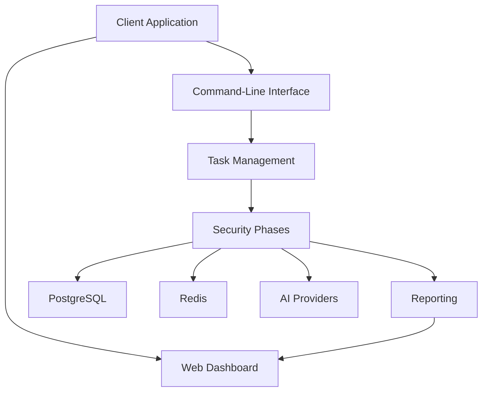

# System Context Overview

## 1. Project Introduction

### Project Name and Description
The project, named **Sentari**, is a comprehensive security assessment tool designed to automate the process of identifying vulnerabilities within systems. It provides a command-line interface (CLI) for executing various security assessment phases, including reconnaissance, scanning, vulnerability assessment, and reporting. Sentari is equipped with a web dashboard for easy visualization of assessment results.

### Core Functionality and Value
Sentari's core functionality lies in its ability to perform automated security assessments, thereby enhancing efficiency and accuracy in vulnerability identification. The tool integrates with AI providers for advanced analysis, offering a sophisticated approach to security assessments. The business value of Sentari is underscored by its capability to streamline security processes, reduce manual effort, and provide detailed, actionable insights into system vulnerabilities.

### Technical Characteristics Overview
Sentari is characterized by its modular architecture, which supports distributed task execution using Celery. It integrates with external AI services for enhanced analysis and utilizes PostgreSQL for data storage and Redis for caching and message brokering. The system is designed for scalability and flexibility, ensuring it can handle complex security assessments and provide comprehensive reporting.

## 2. Target Users

### User Role Definitions
- **Security Analysts**: Professionals responsible for assessing and improving the security posture of systems. They require automated security assessments, detailed vulnerability reports, and integration with existing security tools.
- **DevOps Engineers**: Engineers focused on integrating security assessments into CI/CD pipelines. They need a command-line tool for automation, scalable task execution, and integration with Kubernetes and Docker.

### Usage Scenario Descriptions
- **Security Analysts** use Sentari to conduct thorough security assessments, leveraging its automated capabilities to identify vulnerabilities efficiently. They utilize the web dashboard to visualize results and generate detailed reports for further analysis.
- **DevOps Engineers** integrate Sentari into their CI/CD pipelines to automate security checks, ensuring that vulnerabilities are identified and addressed early in the development process. They benefit from the tool's scalability and integration capabilities.

### User Requirement Analysis
Security Analysts and DevOps Engineers require a tool that is not only efficient and accurate but also integrates seamlessly with their existing workflows. Sentari meets these needs by providing a robust CLI, a user-friendly web interface, and the ability to integrate with external AI services and existing security tools.

## 3. System Boundaries

### System Scope Definition
Sentari's system scope includes components essential for conducting security assessments, managing tasks, and reporting results. The system is designed to execute security phases and provide a web interface for result visualization.

### Included Core Components
- **CLI**: For executing security assessments.
- **Web Dashboard**: For viewing assessment results.
- **Task Management**: Utilizing Celery for distributed task execution.
- **Security Phases**: Including reconnaissance, scanning, and vulnerability assessment.
- **Reporting**: Generating detailed reports of assessment results.

### Excluded External Dependencies
- **External AI Providers**: While Sentari integrates with AI services, the management of these providers is outside its scope.
- **Third-party Security Tools**: Execution and management of external security tools are not included within Sentari's boundaries.

## 4. External System Interactions

### External System List
- **PostgreSQL**: Used for storing assessment data.
- **Redis**: Employed for caching and message brokering.
- **AI Providers**: External services like OpenAI and Google for advanced analysis.

### Interaction Method Descriptions
- **PostgreSQL**: Sentari interacts with PostgreSQL for persistent data storage, ensuring that assessment data is securely stored and easily retrievable.
- **Redis**: Utilized for caching frequently accessed data and facilitating message brokering between system components.
- **AI Providers**: Sentari integrates with AI services via API calls to enhance the analysis capabilities of its security assessments.

### Dependency Relationship Analysis
Sentari's architecture is designed to leverage external systems for enhanced functionality while maintaining a clear boundary between internal components and external dependencies. This separation ensures that Sentari remains focused on its core objectives while benefiting from the advanced capabilities of external systems.

## 5. System Context Diagram

### C4 SystemContext Diagram

### Key Interaction Flows
- The **Client Application** interacts with both the **Web Dashboard** and the **CLI** to initiate and manage security assessments.
- The **CLI** triggers the **Task Management** component, which orchestrates the execution of various **Security Phases**.
- **Security Phases** interact with **PostgreSQL** for data storage and **Redis** for caching and message brokering.
- **AI Providers** are accessed during security assessments for advanced analysis.
- **Reporting** generates results that are displayed on the **Web Dashboard**.

### Architecture Decision Descriptions
The architecture is designed to ensure modularity and scalability, allowing Sentari to efficiently handle complex security assessments. The use of Celery for task management and integration with AI services enhances the tool's capabilities, while the separation of concerns between internal components and external systems maintains system integrity and focus.

## 6. Technical Architecture Overview

### Main Technology Stack
- **Programming Language**: Python
- **Task Management**: Celery
- **Data Storage**: PostgreSQL
- **Caching and Message Brokering**: Redis
- **Web Framework**: Flask (for the web dashboard)
- **AI Integration**: External APIs (OpenAI, Google)

### Architecture Patterns
- **Modular Architecture**: Ensures separation of concerns and facilitates scalability.
- **Microservices**: Utilized for task management and AI integration, allowing for distributed execution and advanced analysis.

### Key Design Decisions
- **Use of Celery**: Enables distributed task execution, improving scalability and performance.
- **Integration with AI Providers**: Enhances the depth and accuracy of security assessments.
- **Web Dashboard**: Provides a user-friendly interface for result visualization, catering to both technical and non-technical users.