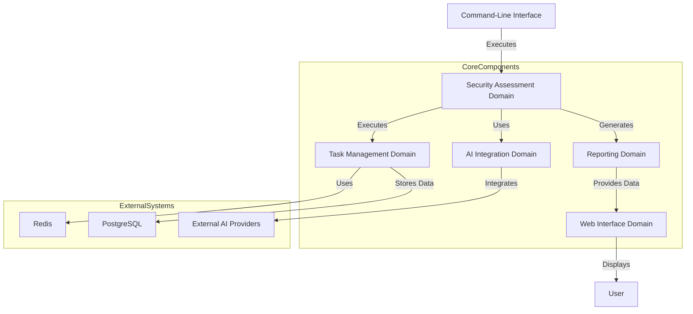

# System Architecture Documentation

## 1. Architecture Overview

The Sentari system architecture is designed to automate security assessments, integrating AI for advanced analysis and providing a web interface for result visualization. The architecture is modular, supporting distributed task execution and integration with external AI providers. This design philosophy emphasizes scalability, flexibility, and comprehensive security assessment capabilities.

### Core Architecture Patterns
- **Modularity**: The architecture is divided into distinct domains, each responsible for specific functionalities, promoting separation of concerns and maintainability.
- **Scalability**: Utilizes Celery for distributed task execution, allowing the system to scale with increased demand.
- **Integration**: Supports integration with external AI providers, enhancing the system's analytical capabilities.

### Technology Stack Overview
- **Programming Language**: Python
- **Task Management**: Celery
- **Data Storage**: PostgreSQL
- **Caching and Message Brokering**: Redis
- **Web Framework**: Flask (for web interface)
- **AI Integration**: External AI providers (e.g., OpenAI, Google)

## 2. System Context

### System Positioning and Value
Sentari offers automated security assessments, improving efficiency and accuracy in identifying vulnerabilities. It supports integration with AI providers for advanced analysis and provides a web interface for easy result visualization.

### User Roles and Scenarios
- **Security Analysts**: Require automated security assessments, detailed vulnerability reports, and integration with existing security tools.
- **DevOps Engineers**: Focus on integrating security assessments into CI/CD pipelines, requiring a command-line tool for automation, scalable task execution, and integration with Kubernetes and Docker.

### External System Interactions
- **PostgreSQL**: Used for storing assessment data.
- **Redis**: Used for caching and message brokering.
- **AI Providers**: External AI services for advanced analysis.

### System Boundary Definition
- **Included Components**: CLI, Web Dashboard, Task Management, Security Phases, Reporting.
- **Excluded Components**: External AI Providers, Third-party Security Tools.

## 3. Container View

### Domain Module Division
The system is divided into several domain modules:
- **Security Assessment Domain**: Handles reconnaissance, scanning, and vulnerability assessment.
- **AI Integration Domain**: Manages integration with AI providers.
- **Task Management Domain**: Utilizes Celery for distributed task execution.
- **Reporting Domain**: Generates reports for security assessments.
- **Web Interface Domain**: Provides a web dashboard and REST API for viewing results.

### Domain Module Architecture

### Storage Design
- **PostgreSQL**: Centralized storage for assessment data, ensuring data integrity and availability.
- **Redis**: Provides fast access to cached data and facilitates message brokering for task management.

### Inter-domain Module Communication
- **API Integration**: Security assessments utilize AI providers for advanced analysis.
- **Service Call**: Tasks are executed to perform security assessments.
- **Data Dependency**: Web interface displays reports generated by the reporting domain.

## 4. Component View

### Core Functional Components
- **Security Assessment Domain**: Orchestrates the assessment process, including reconnaissance, scanning, and vulnerability assessment.
- **AI Integration Domain**: Abstracts AI providers under a unified interface for advanced analysis.
- **Reporting Domain**: Compiles findings into comprehensive reports.

### Technical Support Components
- **Task Management Domain**: Manages distributed task execution using Celery.
- **Web Interface Domain**: Implements a web dashboard and REST API for result visualization.

### Component Responsibility Division
- **Reconnaissance Phase**: Identifies targets and performs basic web fingerprinting.
- **Scanning Phase**: Conducts detailed scanning and enumeration.
- **Vulnerability Assessment Phase**: Runs vulnerability assessments and confirms findings.
- **AI Providers Management**: Checks availability and performs AI-based analysis.
- **HTML Reporting**: Generates self-contained HTML reports.
- **Web Dashboard**: Serves the web dashboard and provides REST API.

### Component Interaction Relationships
- **Security Assessment Domain** interacts with **AI Integration Domain** for AI-based analysis.
- **Task Management Domain** executes tasks for the **Security Assessment Domain**.
- **Reporting Domain** provides data to the **Web Interface Domain** for display.

## 5. Key Processes

### Core Functional Processes
- **Security Assessment Execution**: Executes reconnaissance, scanning, and vulnerability assessment phases.
- **AI-Enhanced Analysis**: Integrates AI analysis into the security assessment process.

### Technical Processing Workflows
- **Task Management and Execution**: Manages distributed execution of tasks using Celery.

### Data Flow Paths
- Data flows from the **Security Assessment Domain** to the **Reporting Domain** and then to the **Web Interface Domain** for visualization.

### Exception Handling Mechanisms
- Error handling is implemented at each phase of the security assessment to ensure robustness and reliability.

## 6. Technical Implementation

### Core Module Implementation
- **Reconnaissance Phase**: Implements target identification and web fingerprinting.
- **Scanning Phase**: Conducts security header analysis and TLS inspection.
- **Vulnerability Assessment Phase**: Utilizes detection engines for vulnerability confirmation.

### Key Algorithm Design
- AI-based analysis algorithms are integrated for enhanced security assessments.

### Data Structure Design
- Utilizes relational databases (PostgreSQL) for structured data storage and retrieval.

### Performance Optimization Strategies
- **Caching**: Redis is used to cache frequently accessed data.
- **Distributed Execution**: Celery enables scalable task execution.

## 7. Deployment Architecture

### Runtime Environment Requirements
- **Python Environment**: Required for executing the CLI and web interface.
- **Database Servers**: PostgreSQL for data storage.
- **Caching Servers**: Redis for caching and message brokering.

### Deployment Topology Structure
- **Distributed Architecture**: Supports deployment across multiple nodes for scalability.

### Scalability Design
- **Celery**: Facilitates distributed task execution, allowing the system to handle increased loads.

### Monitoring and Operations
- **Logging**: Comprehensive logging is implemented for monitoring system performance and diagnosing issues.
- **Monitoring Tools**: Integration with monitoring tools for real-time system health checks.

This architecture documentation provides a comprehensive overview of the Sentari system, detailing its modular design, core processes, and technical implementation. It serves as a valuable resource for development and operations teams, ensuring a clear understanding of the system's architecture and facilitating effective deployment and maintenance.