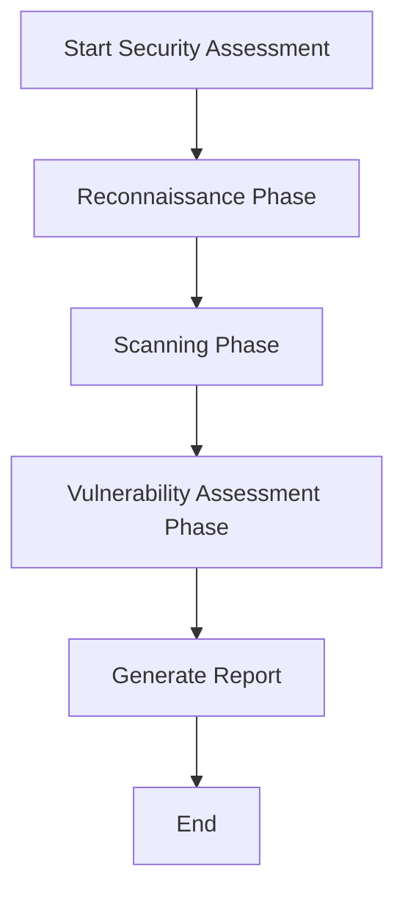
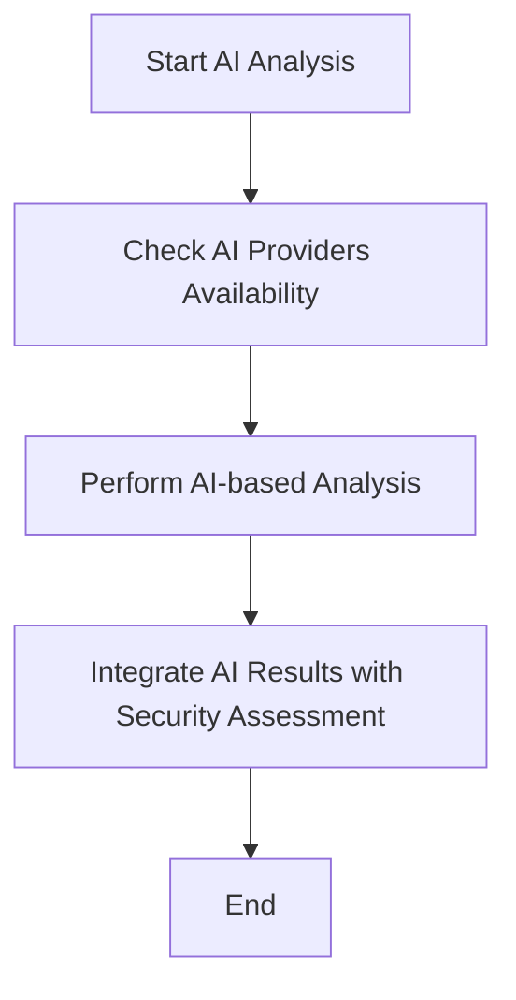
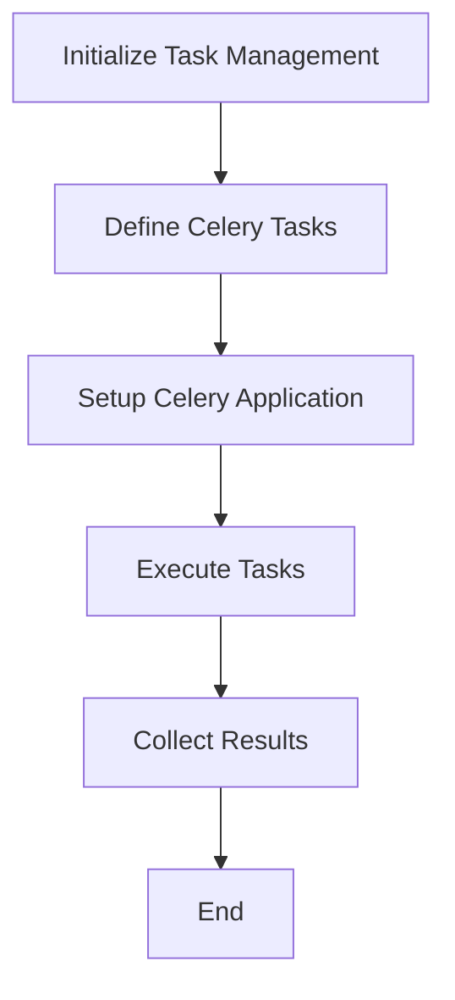

# Core Workflows

## 1. Workflow Overview

The Sentari system is designed to provide comprehensive security assessments through a series of well-defined workflows. These workflows are integral to the system's operation, ensuring that security vulnerabilities are identified efficiently and accurately. The core workflows include:

- **Security Assessment Execution**: This is the primary workflow that encompasses reconnaissance, scanning, and vulnerability assessment phases.
- **AI-Enhanced Analysis**: Integrates AI capabilities to enhance the depth and accuracy of security assessments.
- **Task Management and Execution**: Utilizes Celery for distributed task execution, ensuring scalability and efficiency.

### Core Execution Paths

The main execution paths involve the sequential execution of security assessment phases, followed by AI analysis and task management processes. These paths are designed to maximize the system's ability to detect and report vulnerabilities.

### Key Process Nodes

Key nodes in the workflows include:

- **Reconnaissance Phase**: Initial target identification and web fingerprinting.
- **Scanning Phase**: Detailed scanning and enumeration.
- **Vulnerability Assessment Phase**: Confirmation of vulnerabilities with evidence.
- **AI Analysis**: Advanced analysis using AI providers.
- **Task Execution**: Distributed execution of assessment tasks.

### Process Coordination Mechanisms

The system employs various coordination mechanisms to ensure smooth workflow execution, including:

- **API Integration**: For AI-enhanced analysis.
- **Service Calls**: Between task management and security assessment domains.
- **Data Dependency**: For report generation and web interface display.

## 2. Main Workflows

### Security Assessment Execution

This workflow is the backbone of the Sentari system, designed to systematically identify security vulnerabilities.

#### Core Business Process Details

- **Reconnaissance Phase**: Identifies targets, resolves IPs, and performs basic web fingerprinting.
- **Scanning Phase**: Conducts detailed scanning and enumeration, including security header analysis and TLS inspection.
- **Vulnerability Assessment Phase**: Runs assessments using detection engines like nuclei and sqlmap.

#### Key Technical Process Descriptions

- **Execution Order**: Reconnaissance → Scanning → Vulnerability Assessment → Report Generation.
- **Dependencies**: Each phase builds on the results of the previous one, ensuring a comprehensive assessment.

#### Input/Output Data Flows

- **Inputs**: Target URLs/IPs, configuration settings.
- **Outputs**: Detailed reports, vulnerability findings, and evidence-backed results.

### AI-Enhanced Analysis

This workflow leverages AI to provide deeper insights into security assessments.

#### Process Execution Order and Dependencies

- **Execution Order**: Check AI Providers Availability → Perform AI-based Analysis → Integrate Results.
- **Dependencies**: Relies on external AI providers for advanced analysis capabilities.

### Task Management and Execution

This workflow ensures efficient and scalable execution of security assessments.

#### Process Execution Order and Dependencies

- **Execution Order**: Initialize Task Management → Define Celery Tasks → Setup Celery Application → Execute Tasks → Collect Results.
- **Dependencies**: Utilizes Celery for distributed task execution, ensuring tasks are executed efficiently.

## 3. Flow Coordination and Control

### Multi-module Coordination Mechanisms

- **API Integration**: Between security assessment and AI integration domains.
- **Service Calls**: For task execution and result collection.

### State Management and Synchronization

- **State Management**: Ensures consistent state across distributed tasks.
- **Synchronization**: Uses Redis for caching and message brokering.

### Data Passing and Sharing

- **Data Passing**: Between phases and modules using defined interfaces.
- **Data Sharing**: Through a centralized database for result storage.

### Execution Control and Scheduling

- **Control**: Managed by the CLI and Celery for task execution.
- **Scheduling**: Tasks are scheduled and executed based on priority and resource availability.

## 4. Exception Handling and Recovery

### Error Detection and Handling

- **Detection**: Built-in mechanisms for detecting errors during phase execution.
- **Handling**: Defined error handling procedures for each phase.

### Exception Recovery Mechanisms

- **Recovery**: Automatic retries and fallback strategies for failed tasks.
- **Fault Tolerance**: Designed to handle failures gracefully, ensuring minimal disruption.

### Failure Retry and Degradation

- **Retry**: Configured retries for transient errors.
- **Degradation**: Graceful degradation strategies to maintain core functionalities.

## 5. Key Process Implementation

### Core Algorithm Processes

- **Reconnaissance**: Uses built-in and external tools for target identification.
- **Scanning**: Detailed enumeration using security headers and TLS inspection.
- **Vulnerability Assessment**: Evidence-backed vulnerability confirmation.

### Data Processing Pipelines

- **Pipelines**: Defined for each phase to ensure data is processed efficiently and accurately.

### Business Rule Execution

- **Rules**: Implemented to ensure compliance with security assessment standards.

### Technical Implementation Details

- **Implementation**: Detailed in the respective modules, ensuring modularity and scalability.

### Diagrams

#### Security Assessment Execution

#### AI-Enhanced Analysis

#### Task Management and Execution

This documentation provides a comprehensive overview of the core workflows within the Sentari system, ensuring alignment with business processes and technical requirements. It serves as a valuable resource for development and operations teams, facilitating efficient implementation and management of security assessments.