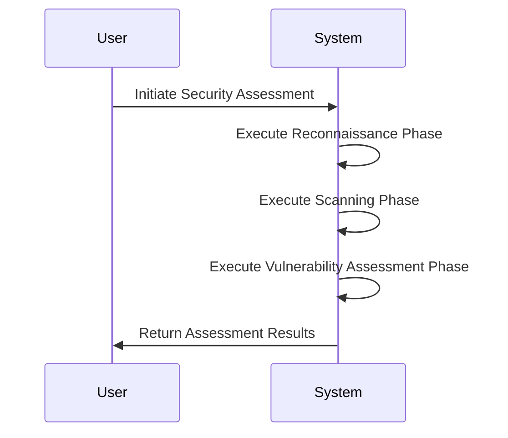

# Security Assessment Domain Documentation

## Overview

The Security Assessment Domain is a core component of the Sentari system, responsible for executing comprehensive security assessments. This domain orchestrates the entire assessment process, which includes reconnaissance, scanning, and vulnerability assessment phases. It is designed to systematically identify potential security vulnerabilities in a system by analyzing various aspects of the target environment.

## Architecture and Design

### Modular Structure

The Security Assessment Domain is implemented using a modular architecture, which enhances maintainability and scalability. Each phase of the security assessment is encapsulated within its own module, allowing for clear separation of concerns and ease of updates or enhancements.

### Core Modules

1. **Reconnaissance Phase**:
   - **Description**: This phase involves identifying existing targets, resolving IPs, and performing basic web fingerprinting.
   - **Key Functions**:
     - Identify targets
     - Resolve IPs
     - Web fingerprinting
   - **Code Path**: `/home/ahmad/Downloads/sentari/sentari/phases/recon.py`

2. **Scanning Phase**:
   - **Description**: Conducts detailed scanning and enumeration of discovered web ports, including security header analysis and TLS inspection.
   - **Key Functions**:
     - Security header analysis
     - TLS inspection
     - Content discovery
   - **Code Path**: `/home/ahmad/Downloads/sentari/sentari/phases/scanning.py`

3. **Vulnerability Assessment Phase**:
   - **Description**: Runs vulnerability assessments using detection engines, confirming vulnerabilities with evidence-backed results.
   - **Key Functions**:
     - Vulnerability detection
     - Evidence-backed results
   - **Code Path**: `/home/ahmad/Downloads/sentari/sentari/phases/vuln.py`

### Interaction and Workflow

The Security Assessment Domain interacts through defined interfaces for each phase, allowing for the sequential execution of reconnaissance, scanning, and vulnerability assessment tasks. The workflow is initiated by the user and proceeds through each phase, ultimately returning the assessment results.

#### Sequence Diagram

## Implementation Details

The Security Assessment Domain is implemented with a base framework that defines abstract classes and methods for phase execution. Each phase is implemented in separate files, with specific functions tailored to the tasks of that phase. This design allows for flexibility in extending or modifying individual phases without impacting the overall system.

### Key Implementation Files

- **Base Framework**: `/home/ahmad/Downloads/sentari/sentari/phases/base.py`
- **Initialization**: `/home/ahmad/Downloads/sentari/sentari/phases/__init__.py`

## Integration and Dependencies

The Security Assessment Domain is tightly integrated with other domains within the Sentari system:

- **AI Integration Domain**: Utilizes AI providers for advanced analysis, enhancing the depth of security assessments.
- **Task Management Domain**: Relies on Celery for distributed task execution, ensuring scalable and efficient processing.
- **Reporting Domain**: Generates detailed reports of the assessment results, which are then displayed through the web interface.

## Conclusion

The Security Assessment Domain is a critical component of the Sentari system, providing automated and comprehensive security assessments. Its modular design, integration with AI capabilities, and reliance on scalable task management make it a robust solution for identifying and addressing security vulnerabilities. This domain effectively supports the system's goals of improving efficiency and accuracy in security assessments.